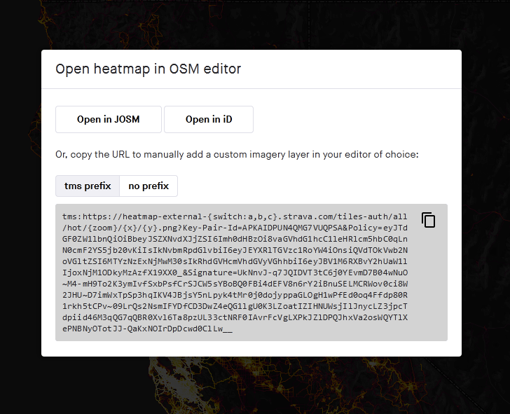

# JOSM Strava Heatmap

This browser extension makes it easy to use the [Strava Global Heatmap][1] in
[JOSM][2], [iD][8], and other mapping applications that support TMS imagery.

Accessing this imagery externally requires a set of key parameters that you obtain
by signing into the Strava website, copying the values from several cookies, and
then assembling into a query string at the end of the url.  The keys expire after a
week or so at which point you must repeat the process.  This extension builds the
url for you which makes this weekly process a bit less annoying.  

**New in v2.0**: Updated to Chrome Extension Manifest V3 with improved security and performance. The generated URLs now include authentication cookies directly in the URL parameters as required by Strava's updated API.

OSM Wiki: [Using the Strava Heatmap][3]

[1]: https://www.strava.com/heatmap
[2]: https://josm.openstreetmap.de/ "Java OpenStreetMap Editor"
[3]: https://wiki.openstreetmap.org/wiki/Strava
[8]: https://www.openstreetmap.org

## Browser Compatibility

### Chrome/Chromium-based browsers
- **Chrome 88+**: Full support with Manifest V3
- **Microsoft Edge 88+**: Full support
- **Opera 74+**: Full support
- **Brave**: Full support

### Firefox
- **Firefox 109+**: Available as a separate Firefox Add-On with Manifest V2
- Firefox Add-On: [Available on Mozilla Add-ons][4]

## Technical Changes (v2.0)

### Manifest V3 Migration
- Updated from Manifest V2 to Manifest V3 for improved security and performance
- Background scripts replaced with service workers
- Enhanced permissions model with `host_permissions`
- Removed dependency on `browser-polyfill.min.js`

### New Chrome API Usage
- Uses native `chrome.runtime` and `chrome.cookies` APIs
- Improved asynchronous message handling between content scripts and service worker
- Better error handling and cookie retrieval across multiple domains

### Updated URL Format
- Generated URLs now include authentication cookies directly in the URL parameters
- Format: `https://content-a.strava.com/identified/globalheat/{type}/{color}/{zoom}/{x}/{y}.png?cookies={cookie_string}`
- Supports all Strava sport types: All, Ride, Run, Walk, Hike, Swim, Ski, etc.
- Automatic sport type mapping (e.g., Walk/Hike → Run, Swim → Water, Ski → Winter)

## Installation

### Chrome/Chromium-based browsers
1. Download the extension files
2. Open Chrome and go to `chrome://extensions/`
3. Enable "Developer mode" in the top right
4. Click "Load unpacked" and select the extension folder

### Firefox
Available as a [Firefox Add-On][4] with Manifest V2 compatibility.

## Instructions

1. Visit [strava.com/heatmap][5] and log in – sign up for a free account if you don't have one
2. *Optional* - Select the heatmap color and activity type you want to use
3. Click the orange button (pictured below) to get the TMS imagery url with authentication cookies included

4. Open the heatmap in your editor
   - Click the appropriate button to open the heatmap in either JOSM or iD.
     For [JOSM, Remote control][9] must be enabled
   - The generated URL includes all necessary authentication cookies and can be used directly

[9]: https://josm.openstreetmap.de/wiki/Help/Preferences/RemoteControl

### Manually adding the imagery in JOSM

Copy the generated URL (which includes cookies). Add a new TMS layer in the [JOSM imagery preferences][6].
Name it Strava Heatmap and paste in the copied url. If you are updating an expired Strava Heatmap
layer you can just double-click it to replace url in the list view.

### Manually adding the imagery in iD

Copy the generated URL (which includes cookies). Open the Backgrounds panel and select "Custom" at the bottom.
Paste the copied url into the Custom Background Settings window that opens.

## Supported Sport Types

The extension automatically maps Strava sport types to the appropriate heatmap categories:

- **All Activities**: `all`
- **Ride/Cycling**: `ride`
- **Run/Running**: `run`
- **Walk/Hike/Trail Run**: `run` (uses running heatmap)
- **Swim/Swimming**: `water`
- **Ski/Snowboard**: `winter`
- **Other sports**: Defaults to `all`

## Color Options

Supported heatmap colors:
- `hot` (default)
- `blue`
- `purple`
- `gray`
- `bluered`
- `mobileblue`

[4]: https://addons.mozilla.org/en-US/firefox/addon/josm-strava-heatmap/
[5]: https://www.strava.com/heatmap
[6]: https://josm.openstreetmap.de/wiki/Help/Preferences/Imagery
[7]: https://chrome.google.com/webstore/detail/josm-strava-heatmap/hicmfobjcbinceoeegookkgllpdgkcdc
