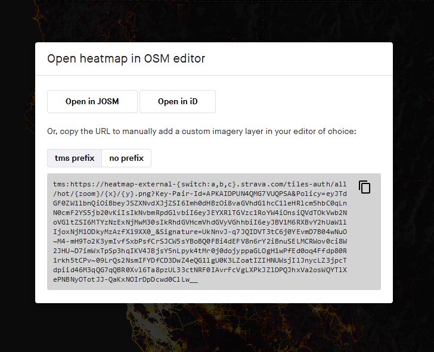

# JOSM Strava Heatmap

This browser extension makes it easy to use the [Strava Global Heatmap][1] in
[JOSM][2], [iD][8], and other mapping applications that support TMS imagery.

Accessing this imagery externally requires a set of key parameters that you obtain
by signing into the Strava website, copying the values from several cookies, and
then assembling into a query string at the end of the url.  The keys expire after a
week or so at which point you must repeat the process.  This extension builds the
url for you which makes this weekly process a bit less annoying.  

**Recent Update**: Fixed overlay button visibility on Strava's updated website. Strava migrated from Mapbox GL JS to a custom Map Rendering Engine (`mre`), removing the `.mapboxgl-ctrl-top-right` control container and causing the button to not appear. The extension now uses modern fixed positioning and dynamic mounting with SPA navigation support so the button reliably appears on `strava.com/heatmap` and `strava.com/maps/global-heatmap`.

OSM Wiki: [Using the Strava Heatmap][3]

[1]: https://www.strava.com/heatmap
[2]: https://josm.openstreetmap.de/ "Java OpenStreetMap Editor"
[3]: https://wiki.openstreetmap.org/wiki/Strava
[8]: https://www.openstreetmap.org

## Browser Compatibility

### Chrome/Chromium-based browsers
- **Chrome 88+**: Full support with Manifest V3
- **Microsoft Edge 88+**: Full support
- **Opera 74+**: Full support
- **Brave**: Full support

### Firefox
- **Firefox 109+**: Available as a separate Firefox Add-On with Manifest V2
- Firefox Add-On: [Available on Mozilla Add-ons][4]

## Recent Updates & Technical Details

### Modern Strava Map Engine & Button Fix
- **Problem**: Strava replaced Mapbox GL with their own in-house canvas Map Rendering Engine (`mre`), removing the `.mapboxgl-ctrl-top-right` DOM container. This caused an unhandled JavaScript error and prevented the overlay button from appearing.
- **Resilient Mounting**: The extension now uses a multi-level mounting strategy, searching for modern Strava map containers (`[data-testid="mre-map-container"]`, `.CoreMap_mapContainer__DtgEU`, `[data-cy="core-map"]`), legacy Mapbox containers, and falling back safely to `document.body`.
- **Viewport-Fixed Positioning**: The button now uses `position: fixed` in the top-right corner of the map viewport beneath Strava's top header (`top: 70px; right: 16px; z-index: 100`), ensuring it is always visible regardless of internal DOM or map library changes.
- **SPA Navigation & Re-render Support**: Added a `MutationObserver` and URL change listener so the button seamlessly persists when navigating across Strava's single-page app (e.g. from Dashboard to Maps) and survives React/Next.js re-renders.
- **Modal Dialog Improvements**: Added a close (`✕`) button, backdrop click dismiss, and `Escape` key dismiss.

### Manifest V3 Migration (v2.0)
- Updated from Manifest V2 to Manifest V3 for improved security and performance
- Background scripts replaced with service workers
- Enhanced permissions model with `host_permissions`
- Removed dependency on `browser-polyfill.min.js`

### Updated URL Format
- Generated URLs include authentication cookies directly in the URL parameters
- Format: `https://content-a.strava.com/identified/globalheat/{type}/{color}/{zoom}/{x}/{y}.png?cookies={cookie_string}`
- Supports all Strava sport types: All, Ride, Run, Walk, Hike, Swim, Ski, etc.
- Automatic sport type mapping (e.g., Walk/Hike → Run, Swim → Water, Ski → Winter)

## Installation

Because this extension is installed as an unpacked browser extension, **you must first download the extension files to your computer**.

### Chrome / Edge / Brave / Opera

#### Step 1: Download the extension files
You can download the extension files using either of the following methods:

- **Option A (ZIP Download - easiest)**:
  1. Click the green **Code** button at the top of the [GitHub repository page](https://github.com/zekefarwell/josm-strava-heatmap).
  2. Select **Download ZIP**.
  3. Extract the downloaded `.zip` file to a folder on your computer (e.g., in your Documents or a dedicated extensions folder). Do not delete this folder after installing, as your browser loads the extension directly from it.

- **Option B (Git Clone)**:
  ```bash
  git clone https://github.com/zekefarwell/josm-strava-heatmap.git
  ```

#### Step 2: Load the extension into your browser
1. Open your browser and navigate to the Extensions management page:
   - **Chrome**: `chrome://extensions/`
   - **Edge**: `edge://extensions/`
   - **Brave**: `brave://extensions/`
   - **Opera**: `opera://extensions/`
2. Enable **Developer mode** using the toggle switch (usually in the top-right corner).
3. Click the **Load unpacked** button (usually in the top-left corner).
4. Browse to and select the folder containing the downloaded extension files (the folder that directly contains `manifest.json`).
5. The **JOSM Strava Heatmap** extension is now installed and active!

> **Note**: Keep the downloaded folder in a permanent location on your drive. If you move or delete this folder, the extension will be removed from your browser.

### Firefox
Available as a [Firefox Add-On][4] with Manifest V2 compatibility.

## Instructions

1. Visit [strava.com/heatmap][5] and log in – sign up for a free account if you don't have one
2. *Optional* - Select the heatmap color and activity type you want to use
3. Click the orange button (pictured below) to get the TMS imagery url with authentication cookies included


4. Open the heatmap in your editor
   - Click the appropriate button to open the heatmap in either JOSM or iD.
     For [JOSM, Remote control][9] must be enabled
   - The generated URL includes all necessary authentication cookies and can be used directly



[9]: https://josm.openstreetmap.de/wiki/Help/Preferences/RemoteControl

### Manually adding the imagery in JOSM

Copy the generated URL (which includes cookies). Add a new TMS layer in the [JOSM imagery preferences][6].
Name it Strava Heatmap and paste in the copied url. If you are updating an expired Strava Heatmap
layer you can just double-click it to replace url in the list view.

### Manually adding the imagery in iD

Copy the generated URL (which includes cookies). Open the Backgrounds panel and select "Custom" at the bottom.
Paste the copied url into the Custom Background Settings window that opens.

## Supported Sport Types

The extension automatically maps Strava sport types to the appropriate heatmap categories:

- **All Activities**: `all`
- **Ride/Cycling**: `ride`
- **Run/Running**: `run`
- **Walk/Hike/Trail Run**: `run` (uses running heatmap)
- **Swim/Swimming**: `water`
- **Ski/Snowboard**: `winter`
- **Other sports**: Defaults to `all`

## Color Options

Supported heatmap colors:
- `hot` (default)
- `blue`
- `purple`
- `gray`
- `bluered`
- `mobileblue`

[4]: https://addons.mozilla.org/en-US/firefox/addon/josm-strava-heatmap/
[5]: https://www.strava.com/heatmap
[6]: https://josm.openstreetmap.de/wiki/Help/Preferences/Imagery
[7]: https://chrome.google.com/webstore/detail/josm-strava-heatmap/hicmfobjcbinceoeegookkgllpdgkcdc
